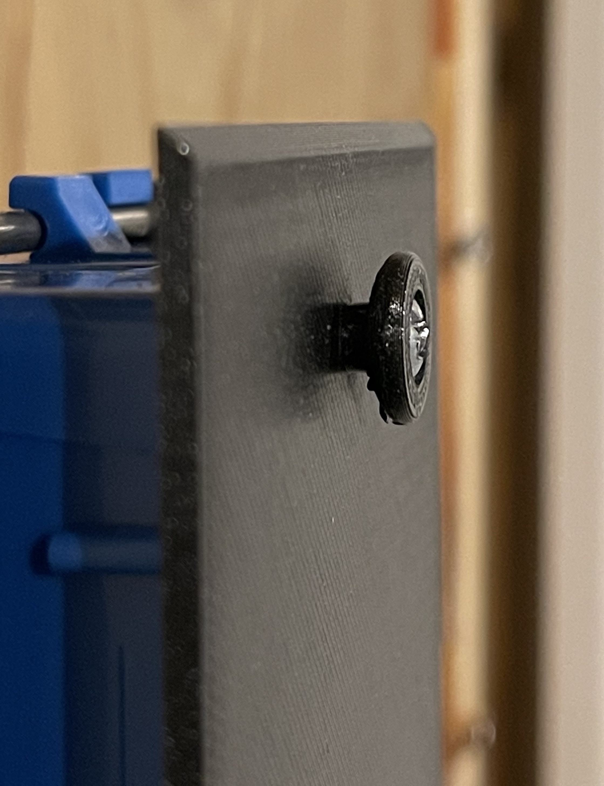

# Cisco SPA500 IP Phone Wall Plate

This is a wall plate that attaches to a standard US 1-gang outlet box that
allows you to surface mount a Cisco SPA500 series phone. It was a one-off
production and the first prototype worked so I did not iterate on the design.

One issue is that cable access hole is larger than the width of a 1-gang box.
That hole could be made smaller, but it's covered by the phone so it's not
visible.

