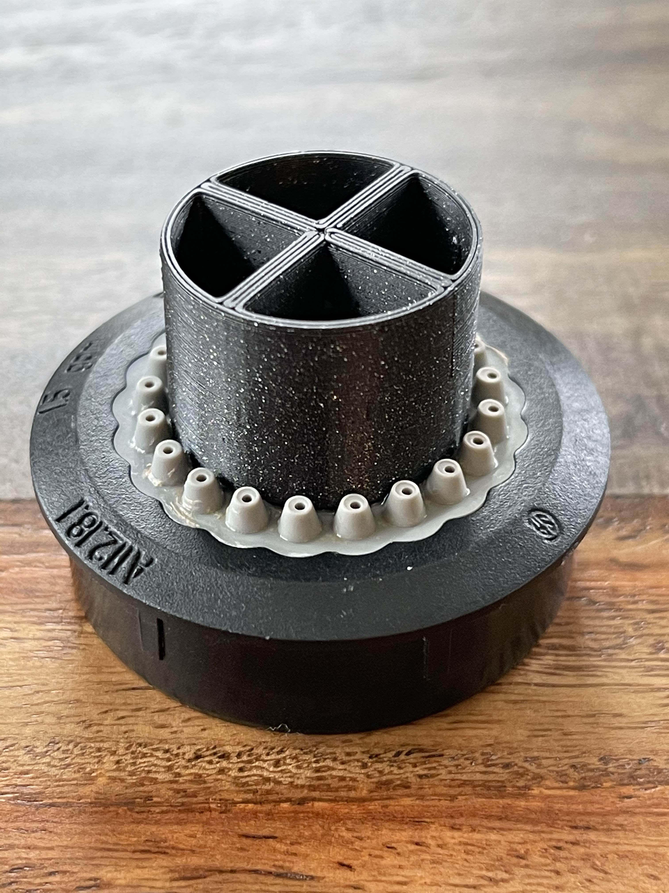

# Moen Pull Down Faucet Aerator Tool

The Moen pull down faucet has two screens that you can clean. One at the top
of the sprayer where the braided hose connects and aerator at the nozzle.
This is a tool to help remove the nozzle to expose the aerator for cleaning
while not damaging it.

In some cases you can remove the nozzle with your hands, but if it's too tight
then you can attach this tool and turn it with a wrench. I spent about 10
minutes making it (it could be better).

Related:

https://www.jonathanrashad.com/a112181m-kitchen-faucet-aerator/
