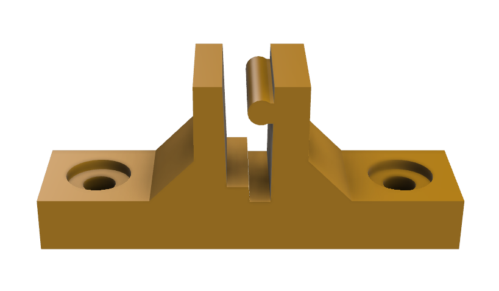

# Hard Kernel Odroid HC2 Wall Mount

This is a design for a simple wall-mount for the Odroid HC2 single board computer.
The holes will accept a M3 screw.

Blog: https://www.andrewkroh.com/3d-prints/2020/12/25/designing-wallmounts-for-odroid-hc2.html

